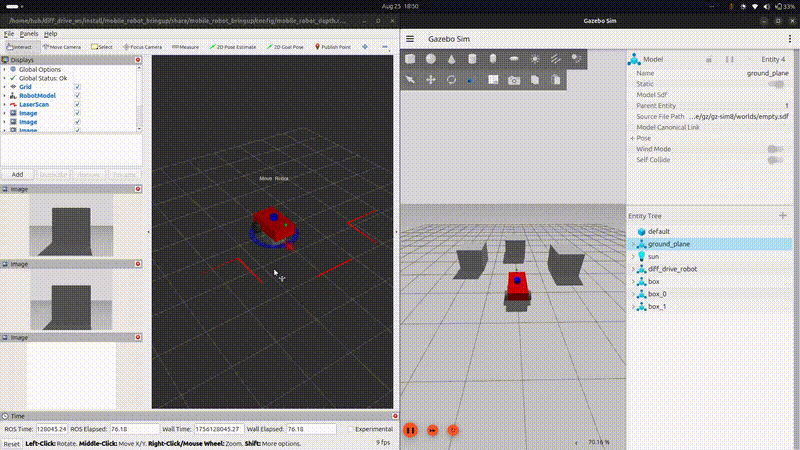

# Modular ROS 2 Mobile Robot Simulation

This repository contains a comprehensive simulation for a differential drive mobile robot, built on **ROS 2 Jazzy** and **Gazebo Harmonic**. It serves as a robust foundation for developing and testing robotics algorithms, featuring a full navigation stack, multiple sensors, and a modular structure designed for easy expansion.

This project demonstrates a complete robotics software pipeline, from low-level robot modeling and simulation to high-level SLAM and autonomous navigation.


*(A preview of the robot navigating in a simulated environment while building a map in RViz2)*

---

## 🌟 Key Features

- **🤖 Full Robot Model**: A detailed differential-drive robot model created with URDF + XACRO.
- **🔥 Gazebo Harmonic Simulation**: Realistic physics and sensor simulation in the latest Gazebo release.
- **🛰️ Multi-Sensor Suite**  
  - **2D LiDAR** for fast, lightweight mapping.  
  - **NEW – 3D LiDAR** (Velodyne-style) with configurable vertical layers and 360 ° horizontal FoV.  
  - **RGB-D Camera** (unified RGB + depth sensor) publishing images, depth, and colored point clouds.  
  - **IMU** for orientation and acceleration data.
- **🗺️ SLAM Integration**  
  - 2D mapping with `slam_toolbox`.  
  - 3D point-cloud generation ready for visual/voxel SLAM pipelines.
- **🧭 Autonomous Navigation**: End-to-end path-planning with the **Nav2** stack.
- **🧹 3D Point-Cloud Filtering**: Real-time PCL node (`pcl_processor`) performs voxel down-sampling, ground-plane removal, and obstacle clustering on the 3D LiDAR stream.
- **🕹️ Interactive Control**: Drag-and-drive interactive marker in RViz2.
- **🧱 Modular & Extendable**: Clean package separation lets you swap sensors or robot bodies with a single launch argument.

---

## 📂 Project Structure

The workspace is organized into several ROS 2 packages, each with a specific responsibility. This modular design follows best practices and promotes code reusability.

```
src/
├── mobile_robot_bringup/      # Main launch files to start simulation, SLAM, and Nav2
├── mobile_robot_description/  # Robot's URDF/XACRO model and meshes
├── mobile_robot_gazebo/       # Gazebo-specific files (world, plugins, bridge)
├── mobile_robot_navigation/   # Nav2 configuration and launch files
├── mobile_robot_slam/         # SLAM Toolbox configuration and launch files
└── mobile_robot_utils/        # Utility scripts (e.g., interactive marker)
```

### Package Breakdown

-   **`mobile_robot_description`**: Contains the robot's physical definition.
    -   `model/robot.xacro`: The main XACRO file. Modify this to change the robot's physical properties, links, and joints.
    -   `model/robot.gazebo`: Gazebo-specific properties, including sensor plugins, materials, and physics.
-   **`mobile_robot_gazebo`**: Manages the simulation environment.
    -   `worlds/`: Defines the Gazebo world files (e.g., `ground.sdf`).
    -   `config/bridge_parameters.yaml`: Defines the ROS-Gazebo bridge, mapping Gazebo topics to ROS 2 topics.
-   **`mobile_robot_bringup`**: The central point for launching the robot.
    -   `launch/bringup.launch.py`: Launches the core simulation, spawning the robot in Gazebo.
    -   `launch/bringup_slam.launch.py`: Starts the simulation and the SLAM node.
    -   `launch/bringup_nav.launch.py`: Starts the simulation and the Nav2 stack.
    -   `config/ekf.yaml`: Configuration for the Extended Kalman Filter (`robot_localization`) for sensor fusion.
-   **`mobile_robot_slam`**: Handles mapping.
    -   `config/slam_toolbox_params.yaml`: All parameters for `slam_toolbox`. Tune these to improve mapping performance.
-   **`mobile_robot_navigation`**: Handles autonomous navigation.
    -   `config/nav2_params.yaml`: All parameters for the Nav2 stack (planner, controller, recovery behaviors).
    -   `maps/`: Stores pre-built maps for localization.
-   **`mobile_robot_utils`**: Contains helpful Python utility nodes.
    -   `interactive_marker_twist.py`: A node that creates an interactive marker in RViz to control the robot by publishing to `/cmd_vel`.

---

## 🚀 Getting Started

### Prerequisites

-   Ubuntu 24.04
-   ROS 2 Jazzy Jalisco
-   Gazebo Harmonic
-   Git and Colcon

### Installation

1.  **Clone the repository:**
    ```bash
    mkdir -p ~/diff_drive_ws/src
    cd ~/diff_drive_ws/src
    git clone <your-repo-url> .
    ```

2.  **Install Dependencies:**
    ```bash
    cd ~/diff_drive_ws
    sudo rosdep init
    rosdep update
    rosdep install --from-paths src -y --ignore-src
    ```

3.  **Build the Workspace:**
    ```bash
    cd ~/diff_drive_ws
    colcon build
    ```

---

## 💻 Usage

Before running any launch file, source your workspace:
```bash
source ~/diff_drive_ws/install/setup.bash
```

### 1. Launch the Basic Simulation  
Now you can choose **2 D** or **3 D** sensor suites at launch time:
2D-LiDAR robot (default)

```bash
ros2 launch mobile_robot_bringup bringup.launch.py robot_type:=2d
```

3D-LiDAR robot with on-board PCL processing
```bash
ros2 launch mobile_robot_bringup bringup.launch.py robot_type:=3d
```

### 2. Launch SLAM
This starts the simulation and launches `slam_toolbox` for creating a map.

2D SLAM (2D LiDAR)

```bash
ros2 launch mobile_robot_bringup bringup_slam.launch.py robot_type:=2d
```

3D point-cloud SLAM starter (publishes filtered /points_3d_filtered)

```bash
ros2 launch mobile_robot_bringup bringup_slam.launch.py robot_type:=3d
``` 

-   Drive the robot around using the interactive marker in RViz to build a map.
-   Save the map using the `slam_toolbox` service:
    ```bash
    ros2 service call /slam_toolbox/save_map slam_toolbox/srv/SaveMap "name:
      map_name: 'my_map'"
    ```

### 3. Launch Navigation
This starts the simulation and launches the full Nav2 stack for autonomous navigation in a pre-mapped environment.

```bash
# Make sure to provide the path to your map file
ros2 launch mobile_robot_bringup bringup_nav.launch.py map:=/path/to/your/map.yaml
```
-   In RViz, use the "2D Pose Estimate" tool to initialize the robot's position.
-   Use the "Nav2 Goal" tool to set a navigation goal.

---

## 🔧 Customization & Configuration

This project is designed to be easily configurable. Here are some common customizations:

- **Switch between 2D and 3D sensors:**  
  Set the `robot_type` launch argument (`2d` or `3d`) in `mobile_robot_bringup/launch/bringup.launch.py`.

- **3D LiDAR specs (layers, range, noise):**  
  Edit the `<sensor type="gpu_lidar">` block in `mobile_robot_description/model/robot.gazebo`.

- **3D point-cloud filter parameters:**  
  Adjust voxel size, RANSAC ground threshold, and cluster tolerances in `mobile_robot_slam/src/pcl_processor.cpp`.

- **Topic bridging for 3D LiDAR:**  
  Edit `mobile_robot_gazebo/config/bridge_parameters.yaml` to map Gazebo `/scan_3d/points` to ROS `/points_3d`.

- **Robot Physical Properties:**  
  Edit `mobile_robot_description/model/robot.xacro` to change dimensions, mass, or inertia.

- **Sensor Parameters:**  
  Modify `mobile_robot_description/model/robot.gazebo` to adjust sensor noise, update rates, or field-of-view.

- **Topic Bridging:**  
  Add or remove topics between ROS and Gazebo by editing `mobile_robot_gazebo/config/bridge_parameters.yaml`.

- **SLAM Tuning:**  
  Adjust `mobile_robot_slam/config/slam_toolbox_params.yaml` to change parameters like `odom_frame`, `map_frame`, or particle filter settings.

- **Navigation Behavior:**  
  Tune robot navigation by modifying `mobile_robot_navigation/config/nav2_params.yaml`. You can change the planner, controller, or costmap parameters.

---

## 🐳 Docker Deployment

For a consistent and hassle-free setup, you can use the provided `Dockerfile` to build and run the entire simulation in a container. This method handles all dependencies and configurations automatically.

### 1. Build the Docker Image

From the root of the workspace (`diff_drive_ws`), run the following command to build the Docker image.

```bash
docker build -t ros2_diff_drive .
```

### 2. Run the Docker Container

To run GUI applications like Gazebo and RViz from within the container, you need to share your host's display with the container.

**First, allow local connections to your X server (run this once per session on your host machine):**
```bash
xhost +local:docker
```

**Now, run the container:**
```bash
docker run -it --rm \
    --privileged \
    --net=host \
    -e DISPLAY=$DISPLAY \
    -v /tmp/.X11-unix:/tmp/.X11-unix:rw \
    ros2_diff_drive
```
-   `--privileged` and the `-v` volume mount are for GUI forwarding.
-   `--net=host` ensures seamless network communication for ROS 2 nodes.
-   You will now be inside the container's `bash` shell, with the ROS 2 environment ready to go.

### 3. Launch the Simulation from Docker

Once inside the container, you can run any of the launch commands as you would normally. For example, to launch SLAM:

```bash
ros2 launch mobile_robot_bringup bringup.launch.py
```

Gazebo and RViz2 windows will appear on your host machine, allowing you to interact with the simulation as if you were running it natively.


## 📈 Future Prospects & Work in Progress

This project is an active endeavor with several planned enhancements:

-   **[In Progress] Advanced Sensor Integration**:
    -   Implement visual SLAM using the RGB-D camera.
-   **[Planned] Multi-Robot Simulation**:
    -   Develop a launch system to spawn multiple robots in the same environment.
    -   Implement a basic multi-robot communication and coordination system.
-   **[Planned] Behavior Tree Development**:
    -   Create custom behavior tree nodes in Nav2 for complex tasks (e.g., "inspect object," "patrol area").
-   **[Planned] Physical Robot Integration**:
    -   Create a hardware interface package (`mobile_robot_hw`) to allow the same software stack to run on a physical differential drive robot.
-   **[Planned] CI/CD Pipeline**:
    -   Set up a GitHub Actions workflow to automate building and testing on every push, ensuring code quality and reliability.

---


